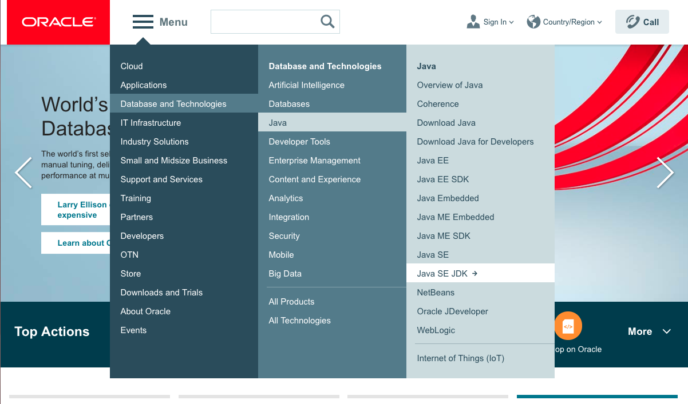
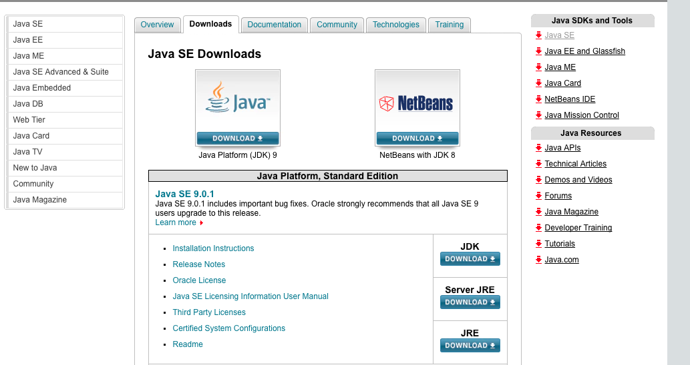
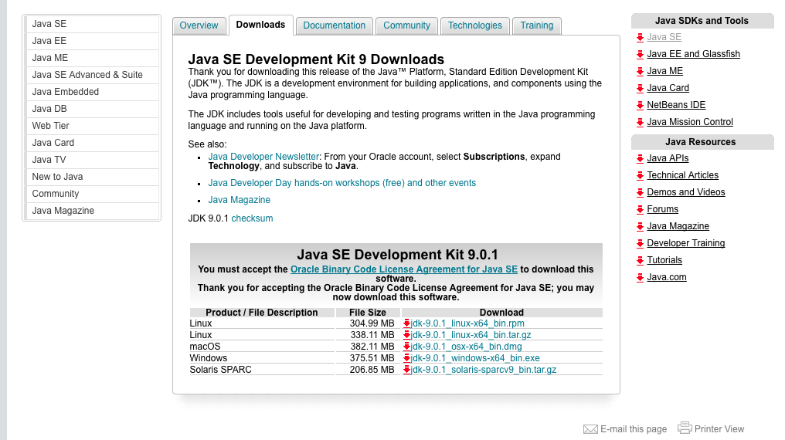
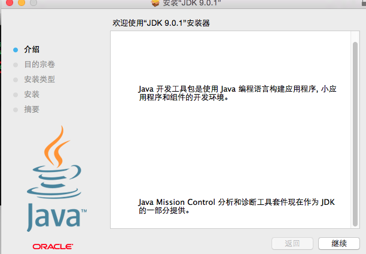
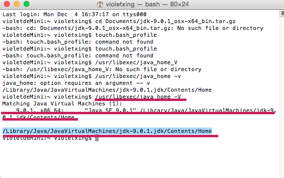
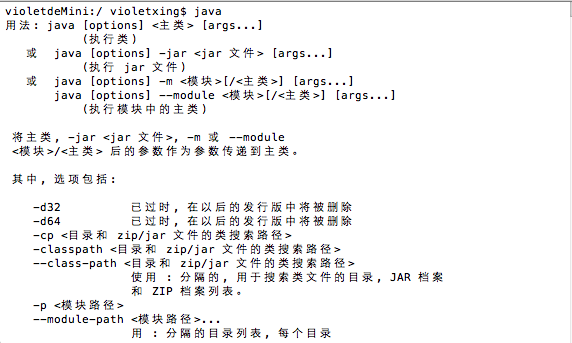

# 在mac系统上安装Jdk

1.进入oracle官网，找到Java SE JDK



2.点击Java Download



3.下载mac os



4.安装Jdk



5.安装好后用终端查找jdk的目录

```
/usr/libexec/java_home -V
```
**注意事项：”java_home“后面有空格，“V”为大写**



* 第一条红线是：输入的命令
* 第二条红线是：当前mac已安装jdk的目录
* 第三条红线是：mac默认使用的jdk的版本
   
6.检查是否安装好java



这就是安装好了！


